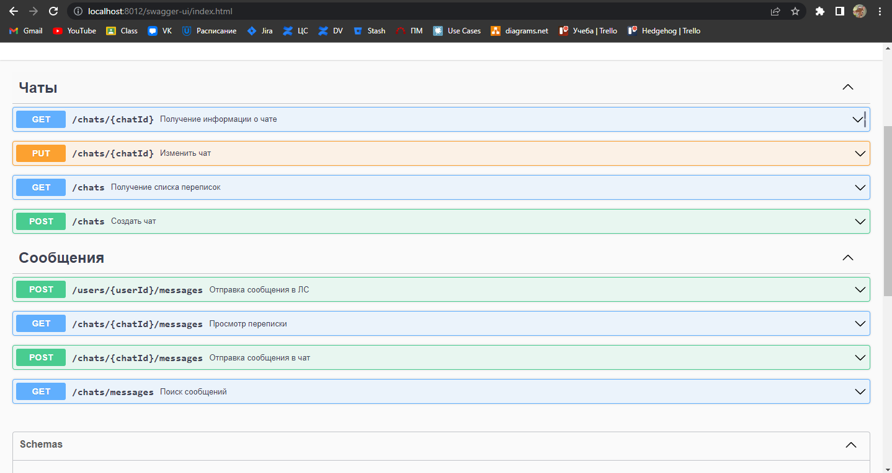
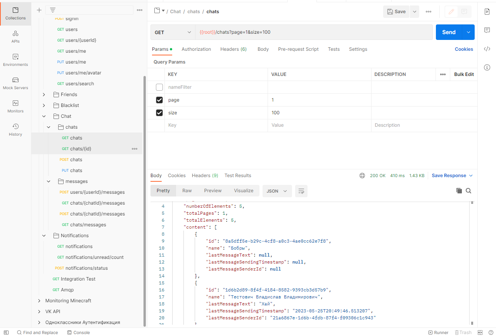

# Spring Messenger
## Структура модулей
**Микросервисы:**
* messenger-gateway - прокси сервер
* messenger-user - микросервис пользователей и авторизации
* messenger-friends - микросервис друзей
* messenger-chat - микросервис чатов
* messenger-notifications - микросервис уведомлений
* messenger-file-storage - микросервис файлового хранилища

**Вспомогательные свои spring boot starter:**
* messenger-boot-jwt - модуль для подключения JWT конфигурации
* messenger-boot-integration - модуль для подключение защиты по API-KEY для интеграционных методов
* messenger-boot-common - базовый модуль с настройкой JWT и интеграций. Содержит много общих классов: DTO, Exception'ы и прочее.
* messenger-amqp-producer - модуль с конфигурациями MQRabbit для отправки сообщений сервису уведомлений

**Вспомогательные свои библиотеки:**
* messenger-amqp-common - базовые DTO для передачи через AMQP и некоторые интерфейсы сервисов

## Install
* Поднимите окружение `docker-compose up .`
* Запустите все микросервисы (Dockerfile не подготовил, поэтому придётся вручную)
* Если возникнут проблемы с docker-compose, можно попробовать поднять отдельно все `docker-compose.local.yaml` внутри модулей

## Использование
* Посмотреть все методы микросервисов можно в swagger, перейдя по `http://localhost:{port}/swagger`
Порты микросервисов:
  * 8010 - микросервис пользователей
  * 8011 - микросервис друзей!
  * 8012 - микросервис чатов
  * 8013 - микросервис уведомлений
  * 8014 - микросервис файлового хранилища
* Вызывать методы можно как через swagger, так и через Postman (предпочтительнее).
  
* Также через Postman можно вызывать методы всех микросервисов через прокси (gateway),
которое будет доступно по url `http://localhost:8080`
  

## Что реализовано?
**Функционал**

Реализован почти весь функционал за исключением некоторых маленьких мелочей. 
* **messenger-user**
  * Регистрация, авторизация
  * Просмотр своего профиля
  * Изменения профиля, в том числе и аватарки
  * Нетривиальный поиск пользователей
  * RabbitMQ producer для синхронизации данных пользователей с другими микросервисами
  * Отправка уведомлений через RabbitMQ в микросервис уведомлений
  * Интеграционные API методы
* **messenger-friends**
  * Добавление и удаление друзей (тоже самое для черного списка)
  * ~~Синхронизация через PATCH (тоже самое для черного списка)~~
  * Синхронизация через RabbitMQ имени пользователя
  * Отправка уведомлений через RabbitMQ в микросервис уведомлений
  * Тривиальный и нетривиальный поиск друзей и заблокированных пользователей
  * Интеграционные API методы
* **messenger-chat**
  * Создание групповых чатов и их изменение (с поддержкой аватарки)
  * Нетривиальный поиск чатов по их названию
  * Получение информации о чате
  * Отправки личных сообщений и групповых сообщений
  * Нетривиальный поиск всех сообщений и сообщений в чате
  * Синхронизация через RabbitMQ имени пользователя и аватарки
  * Отправка уведомлений через RabbitMQ в микросервис уведомлений
  * Хранение метаданных о вложениях в БД
* **messenger-notifications** 
  * API для получения уведомлений и их прочтения
  * RabbitMQ consumer для получения уведомлений из других микросервисов
* **messenger-file-storage**
  * Загрузка и скачивание файлов в MinIO
  * Интеграционные API методы
* **_И другие функции, которые не были расписаны здесь_**

**Примечания к реализации**
* Название некоторых endpoint'ов (и их HTTP методы) отходят от задания 
в git.hits.tsu.ru, однако суть этих endpoint'ов сохраняется.
* Загрузка файлов происходит не напрямую в микросервис file-storage, а через другие микросервисы
(messenger-user, messenger-chat).
* Информация о метаданных файлов вложений хранятся в БД messenger-chat
* Синхронизация данных о пользователе между сервисами messenger-chat, messenger-friends и messenger-user
происходит через RabbitMQ. То есть, если пользователь поменял имя в микросервисе user,
то оно поменяется и во всех других микросервисах. Однако, если пользователь создал чат, то данные о его имени подтянутся с микросервиса
user через HTTP.

**Тестирование**:
* Покрытие сервисов unit тестами более чем на 80%
* Полное покрытие api тестами сервиса messenger-user
* Частичное покрытие api тестами сервисов messenger-friends и messenger-chat

**Логирование**
* Везде в сервисах (и не только) добавлено логирование на разных уровнях (ERROR / INFO / DEBUG / TRACE)
* Изменить уровень логирования можно в `application.yaml`

**Документация**
* Покрыта большая часть кода JavaDoc
* Написана документация под swagger (с помощью аннотаций)

**Миграции БД**
* Для всех микросервисов, которые используют БД, реализованы миграции flyway

**Контроллеры**
* Аутентификация пользователей происходит через JWT
* Для интеграционных запросов аутентификация происходит через API-KEY
* Методы проходят валидацию через `spring-boot-starter-validation`
* Обработка ошибок с помощью механизмов `@ResponseStatus` и `@ControllerAdvice`

## Самокритика
**Качество кода**

В некоторых местах присутствуют неоптимизированный код, sql запросы. 
Также иногда присутствуют copy-paste кода в разных модулях (хотел вынести всё в модули).
Однако по большей части старался писать всё красиво.